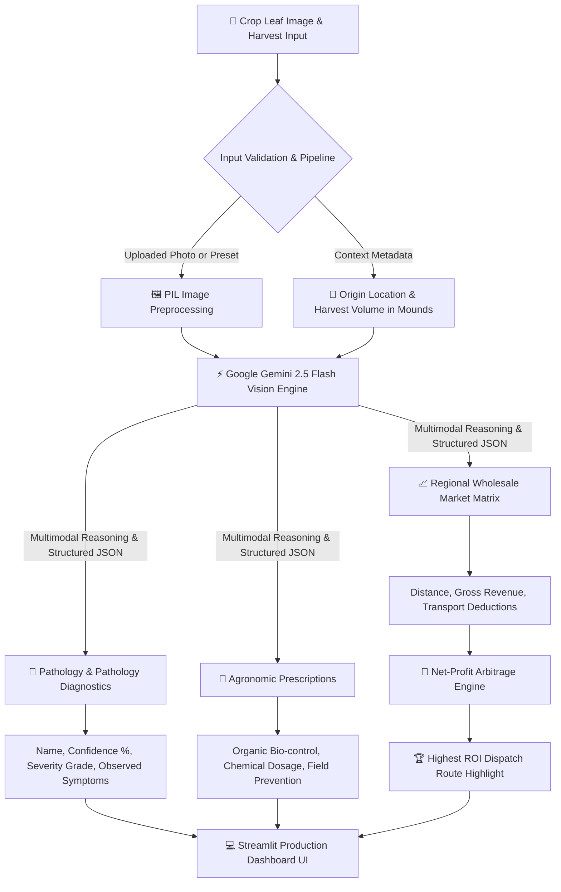

# 🌾 AgriPulse AI: Autonomous Crop Pathology & Fair-Trade Wholesale Arbitrage Engine

[](https://www.python.org/)
[](https://streamlit.io/)
[](https://ai.google.dev/)
[](LICENSE)
[](https://hackathon.example.com)

> **Empowering smallholder farmers with multimodal computer vision pathology diagnosis and real-time wholesale market arbitrage to eliminate yield losses and maximize fair-trade profit margins.**

---

## 🎯 The Core Problem & Real-World Impact

Smallholder farmers across developing agricultural economies face a twin crisis:
1. **Devastating Crop Pathologies**: Plant diseases like *Rice Blast*, *Potato Late Blight*, and *Tomato Yellow Leaf Curl* spread rapidly across adjacent fields. Without immediate, accurate agronomic diagnosis, farmers lose up to **40-70% of their annual crop yield**.
2. **Exploitative Middleman Asymmetries**: Local village traders (*farias* / middlemen) underpay farmers by taking advantage of information gaps regarding pricing at major regional wholesale market hubs (*araths*). Farmers frequently sell at a loss simply because they lack transparent calculations comparing distant wholesale prices against truck transport and fuel expenses.

### Why Traditional Apps Fail
Existing digital agriculture tools are fragmented—they either provide isolated plant disease identification without actionable chemical dosage guidelines, or display static commodity price tickers without deducting fuel, mileage, and transit spoilage risks.

### The AgriPulse AI Solution
**AgriPulse AI** closes the loop by combining **Multimodal AI Pathology Vision** (`gemini-2.5-flash`) with an **Autonomous Fair-Trade Route Arbitrage Engine**. In a single workflow, farmers obtain instant disease identification, targeted dual-treatment prescriptions (organic bio-control + chemical dosage), and real-time net-profit computations across competing regional wholesale market hubs.

---

## 🏗️ High-Level System Architecture



---

## 💡 Key Features & Innovation Matrix

| Feature | Capability | Technical Execution |
| :--- | :--- | :--- |
| **🔬 Multimodal Pathology Vision** | Instant diagnosis of foliar diseases across major cereal, tuber, and vegetable crops | Ingests leaf images with context metadata via `google-genai` SDK and `gemini-2.5-flash` model |
| **💊 Dual Agronomic Prescriptions** | Delivers actionable eco-friendly bio-controls alongside targeted chemical fungicides/pesticides | Generates exact active ingredient recommendations, water dilution ratios, and spraying intervals |
| **📈 Wholesale Route Arbitrage** | Calculates real net-profit yields across multiple competing regional wholesale markets (*araths*) | Evaluates gross harvest revenue minus distance-based mileage, fuel surcharges, and volume transit costs |
| **🏆 ROI Dispatch Highlight** | Identifies optimal market destination with financial reasoning | Computes net BDT gains per mound and surfaces highest ROI market in a prominent visual banner |
| **⚡ Keyless Simulation Engine** | Enables 100% out-of-the-box evaluation without requiring an API key | Includes pre-configured, high-fidelity synthetic leaf specimens and regional market models |

---

## 🛠️ Technology Stack

- **Core Runtime**: Python 3.11+
- **Frontend / UI Layer**: Streamlit 1.30+ with custom CSS glassmorphic cards and responsive column layouts
- **AI & Vision Engine**: Google Gemini 2.5 Flash (`google-genai` official SDK v0.1+)
- **Image Processing**: Pillow (PIL) 10.0+
- **Data & Structure**: Pydantic v2 & JSON schema structured output parsing

---

## 🚀 Quickstart & Local Installation Guide

### Prerequisites
- Python 3.11 or higher
- Git
- Google Gemini API Key (*Optional: app includes simulation mode*)

### Installation Steps

1. **Clone the Repository**:
   ```bash
   git clone https://github.com/your-username/agripulse-ai.git
   cd agripulse-ai
   ```

2. **Create & Activate Virtual Environment**:
   ```bash
   # Windows (PowerShell)
   python -m venv venv
   .\venv\Scripts\Activate.ps1
   
   # Linux / macOS
   python3 -m venv venv
   source venv/bin/activate
   ```

3. **Install Dependencies**:
   ```bash
   pip install -r requirements.txt
   ```

4. **Launch the Application**:
   ```bash
   python -m streamlit run app.py
   ```
   *The Streamlit web dashboard will launch at `http://localhost:8501`.*

---

## 🏆 Hackathon Submission & Demo Context

- **Event**: HackOnVibe 2026
- **Target Tracks**: 
  - **Business Success**: Unlocking fair-trade financial margins for rural farmers through algorithmic logistics arbitrage.
  - **Global Impact & Sustainability**: Reducing chemical overuse through targeted bio-control prescriptions and preventing systemic crop failures.
- **Future Roadmap**:
  - **IoT Soil Integration**: Ingest real-time N-P-K soil moisture sensor data via MQTT.
  - **Offline Edge Caching**: Deploy quantized MobileNet diagnostic models on edge microcontrollers for zero-connectivity field operation.

---

## 📄 License

Distributed under the **MIT License**. See [`LICENSE`](LICENSE) for complete details.
